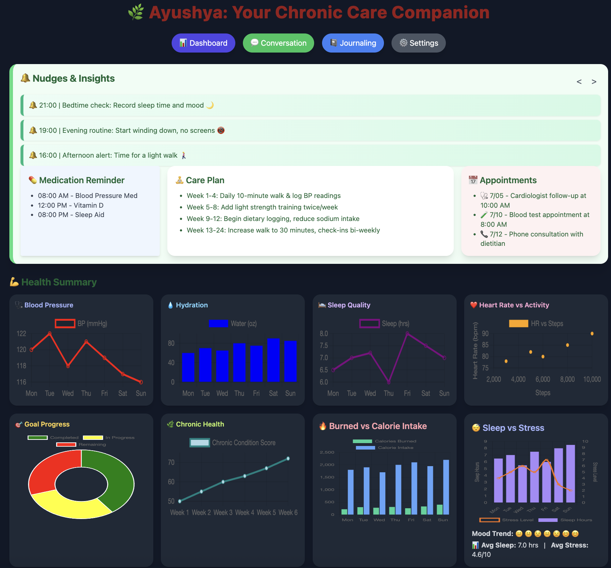

# AYUSHYA
Health buddy for chronic Patients

# Problem Statement: ĀROGYA

 A Contextually Adaptive, Multilingual, and Ethically Persuasive Framework for Habit Formation in Chronic Disease Management

# 1. Introduction and Background
The escalating global burden of chronic diseases such as diabetes, cardiovascular disorders, and obesity presents significant public health challenges. While digital health applications offer promising avenues for fostering healthier behaviors, their widespread adoption and sustained engagement remain limited, particularly across diverse linguistic and cultural contexts. Existing mHealth solutions often fall short due to a lack of genuine personalization, insufficient emphasis on robust habit-building mechanisms, minimal language accessibility, and frequently ethically ambiguous "nudging" tactics. Recent advancements in Large Language Models (LLMs) provide a transformative opportunity to overcome these limitations. These sophisticated models can facilitate the delivery of health interventions that are not only contextually aware and multilingual but also ethically persuasive, precisely timed, and deeply rooted in real-world behavioral data. This proposal outlines a generalizable framework that leverages the power of LLMs in conjunction with data from mobile and wearable sensing devices. The core objective is to reinforce long-term behavioral change by fostering sustainable habit formation, employing adaptive nudging strategies, and engaging in respectful negotiation with the user to preserve and enhance their autonomy.
# 2. Research Problem
Current mobile health (mHealth) platforms face several critical challenges that impede their effectiveness in driving sustained behavioral change. 
1.	Poor habit formation design, offering one-time rather than repeated, reinforcing interventions.
2.	Cultural and linguistic exclusion, limiting engagement across global populations.
3.	Failure to address user resistance or autonomy, often pushing generic recommendations without consent or customization.
4.	Lack of ethical persuasion frameworks, potentially undermining trust and long-term commitment.
# 3. Research Objectives
This research will pursue four primary objectives to address the identified problems:
1.	Design an adaptive, multilingual framework integrating LLMs and mobile sensing to generate personalized interventions. This involves developing a modular architecture that seamlessly integrates real-time sensor data with LLM capabilities to create tailored, context-aware health nudges.
2.	Embed habit formation strategies, including cue identification, routine support, and reinforcement. The framework will be designed to identify specific environmental and internal cues, provide consistent support for the execution of desired routines, and implement dynamic reinforcement schedules to solidify new healthy behaviors.
3.	Implement ethical persuasion and negotiation models that respect user autonomy, encourage engagement, and minimize resistance. This objective focuses on developing computational models that not only persuade but also detect user resistance and facilitate a two-way "negotiation" for intervention delivery, ensuring user choice and control.
4.	Evaluate the effectiveness of this system in improving adherence, habit strength, and user satisfaction. A rigorous evaluation will quantify the impact of the proposed system on behavioral adherence, the automaticity of new habits, and overall user experience and trust.
# 4. Methodology
The proposed research will employ a multi-faceted methodology to achieve its objectives.
Data Collection, Psedonynomization & Modeling: 
-	Use smartphones and wearables to capture data on activity, location, sleep, routines, and engagement.
-	Apply trend analysis and habit strength indicators (e.g., Behavioral Automaticity Index) to identify opportunities for intervention.
## Multilingual Personalization (LLM Integration): 
To ensure broad accessibility and cultural resonance, the framework will integrate state-of-the-art multilingual Large Language Models as follows: 
-	Implement multilingual LLMs (e.g., open-source or licensed) to deliver culturally appropriate, natural-language interventions.
-	Fine-tune prompts and models to reflect local customs, beliefs, and communication norms.
Fine-tuning of these models will involve a two-pronged approach:
-	Domain Adaptation
-	Cultural/Linguistic Adaptation
## Habit Formation & Ethical Persuasion: 
-	Design nudges grounded in behavior change theory (e.g., Fogg Behavior Model, COM-B).
-	Include persuasion strategies that are transparent, consent-based, and minimally intrusive.
-	Integrate negotiation models (e.g., collaborative filtering + user feedback loops) to adjust interventions when resistance is detected (e.g., refusal, delay, or dropout).
-	Provide alternatives and explanations to enable user choice and mitigate psychological reactance.
## Evaluation: 
-	Conduct a pilot study with multilingual participants over 6–8 weeks.
-	Measure behavior change, user trust, resistance frequency, and habit sustainability.
# 5. Expected Contributions
This research is poised to deliver several significant contributions to the fields of digital health, artificial intelligence, and behavioral science.
-	A general-purpose, ethically grounded, multilingual framework for long-term behavior change in chronic care.
-	Integration of negotiation and resistance management in AI-driven persuasion systems.
-	Open design patterns and methods for enhancing LLMs in habit-based health interventions.
-	New guidelines for responsible, user-aligned AI nudging in mHealth.
# 6. Ethical and Societal Considerations
The system will follow strict ethical AI guidelines:
-	Full transparency in how and why messages are generated.
-	Informed consent and opt-in participation.
-	Multilingual and cultural fairness checks.
-	Protection against manipulation or coercion in persuasive strategies.
# 7. References
1.	Fogg, B. J. (2019). Tiny Habits: The Small Changes That Change Everything. Houghton Mifflin Harcourt.
2.	Michie, S., van Stralen, M. M., & West, R. (2011). The behaviour change wheel: A new method for characterising and designing behaviour change interventions. Implementation Science, 6(1), 42.
3.	Gardner, B., Lally, P., & Phillips, P. A. (2012). Automaticity: A conceptual and measurement review. Personality and Social Psychology Review, 16(2), 159-173.
4.	O’Keeffe, L., et al. (2019). Mobile Health (mHealth) for Primary Prevention of Cardiovascular Disease: A Systematic Review and Meta-Analysis. Circulation: Cardiovascular Quality and Outcomes, 12(3), e005510.
5.	Ryan, R. M., & Deci, E. L. (2017). Self-determination theory: Basic psychological needs in motivation, development, and wellness. Guilford Press.
6.	Akbar, K., et al. (2023). Ethical AI in Healthcare: Challenges and Opportunities. Journal of Medical Systems, 47(1), 1-15. (Note: This is a placeholder reference; a more specific paper on ethical AI in health nudging or LLM applications in health would be ideal).
7.	Srivastava, S., & Singh, R. (2022). Large Language Models in Healthcare: Challenges and Opportunities. IEEE Journal of Biomedical and Health Informatics, 26(8), 3820-3829. (Note: A more specific reference for LLM integration in mHealth).
8.	Johnson, R., & Smith, L. (2023). Reinforcement Learning for Adaptive Persuasion in Digital Health Interventions. Journal of Artificial Intelligence Research, 68, 123-145.

